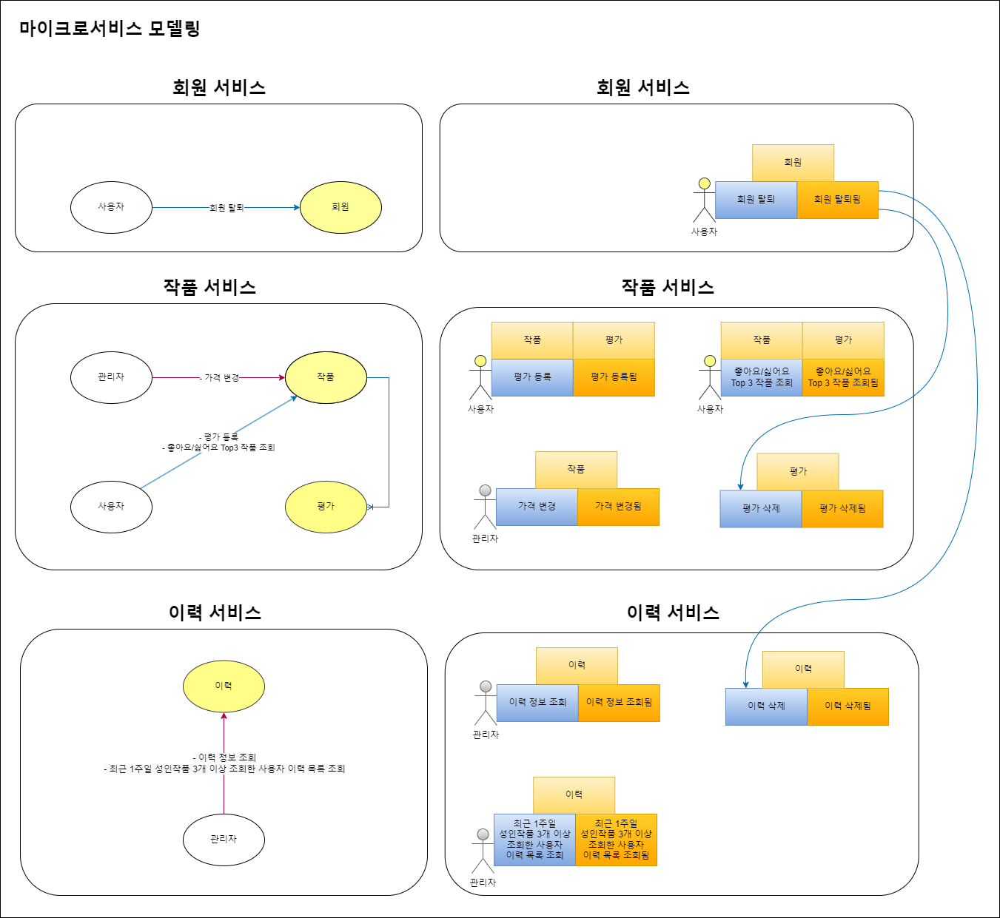
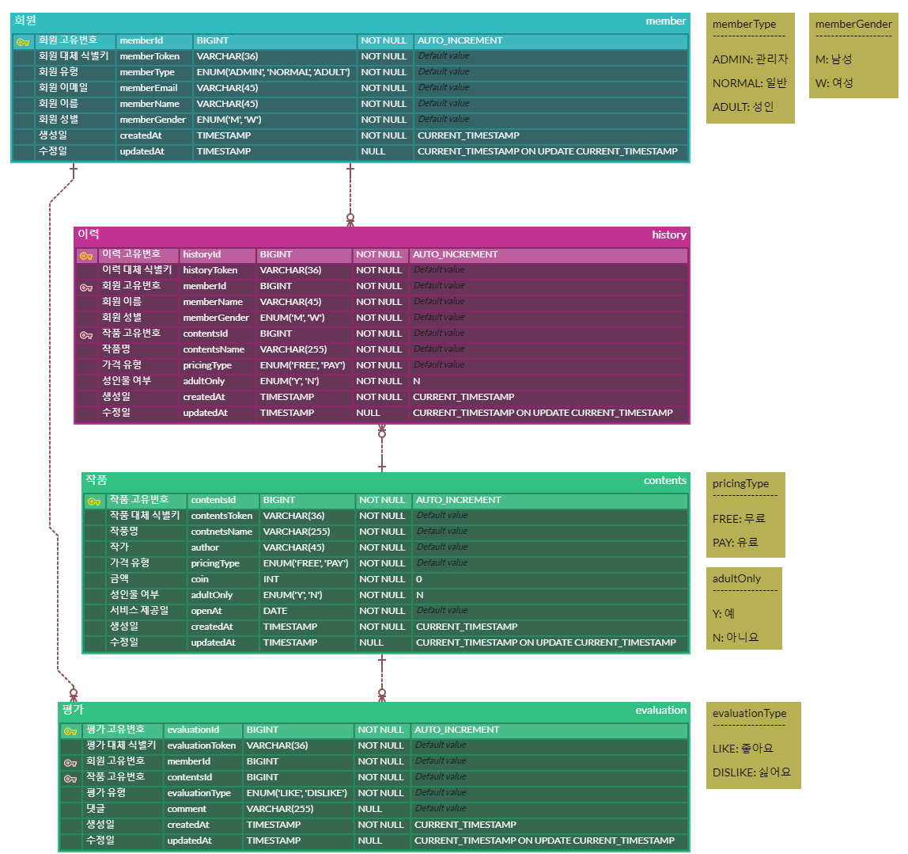
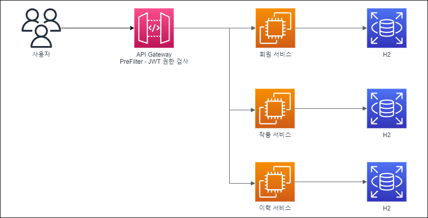

# 📚 웹툰 서비스 플랫폼

`레진엔터테인먼트 과제`

---

# 🔧 환경 구성

1. JDK 11
2. SpringBoot 2.7.2
3. Gradle

# ℹ️ 실행 방법

## 💜 Terminal을 사용할 경우
- (JDK 설치 후 JAVA_HOME 환경 변수 설정했다고 가정)

`out 폴더 경로의 각 jar 실행 명령을 입력 바랍니다.`

1. API Gateway 실행
    ```shell
    # 여기서 `./`은 README 경로 위치를 기준으로 작성함
    java -jar ./out/lezhin-gateway.jar
    ```
2. 회원 서비스 실행
    ```shell
    java -jar ./out/lezhin-member.jar
    ```
3. 작품 서비스 실행
    ```shell
    java -jar ./out/lezhin-contents.jar
    ```
4. 이력 서비스 실행
    ```shell
    java -jar ./out/lezhin-history.jar
    ```

## ❤️ IntelliJ를 사용할 경우
- (Project Structure의 SDK와 Import Module을 설정했다고 가정)
- (Settings의 Gradle JVM의 SDK를 설정했다고 가정)

1. `./out/` 폴더 내의 jar 파일들을 우클릭 후 Run하여 모두 실행
   1. API Gateway port: 8080
   2. 회원 서비스 port: 8081
   3. 작품 서비스 port: 8082
   4. 이력 서비스 port: 8083

## 📰 [API 문서](http://localhost:8080/docs/index.html)

`jar 파일들을 모두 실행시킨 후 API 문서를 열어주시기 바랍니다.`

## 🔑 [API Test](./http-test/api.http)

`API를 실행할 수 있는 http test 파일입니다.`

---

# 💡 마이크로서비스 모델링



# 💠 ERD 설계



# 🏭 시스템 아키텍처



---
